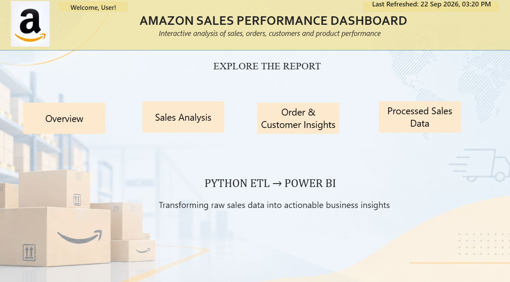
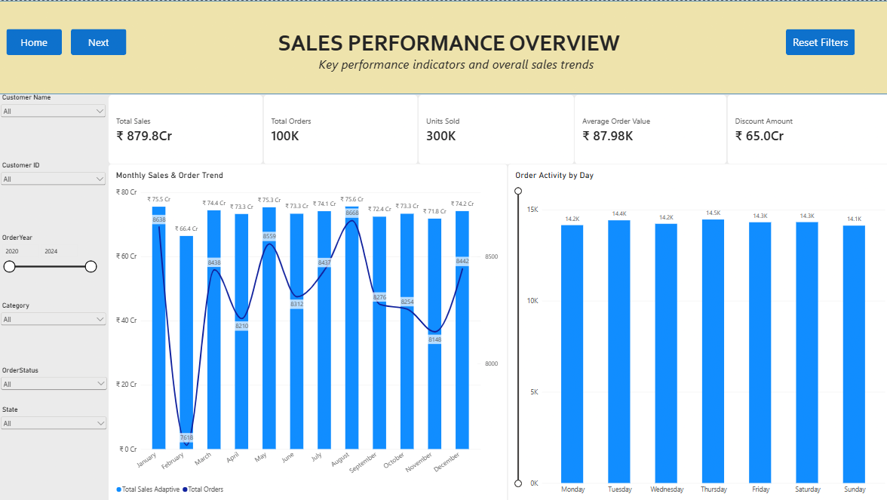
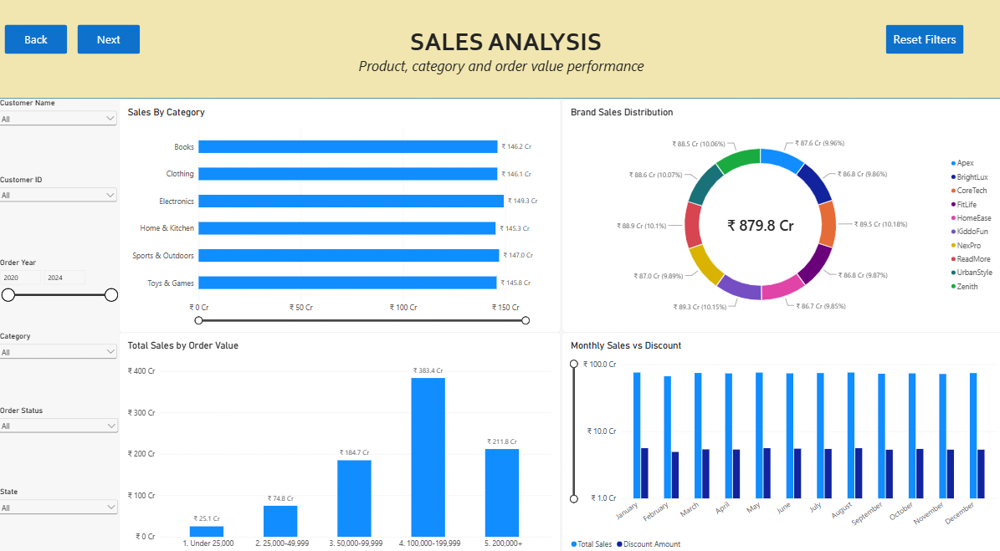
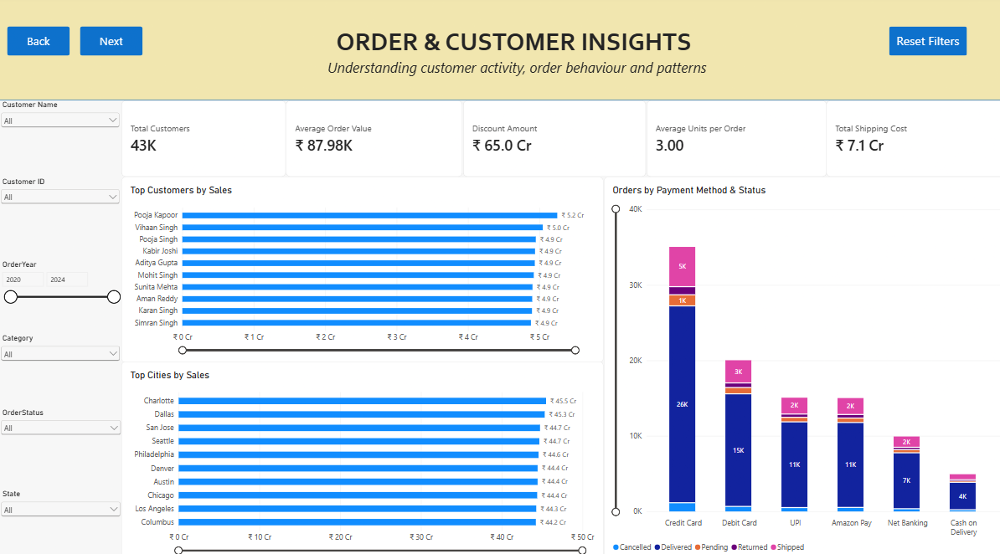
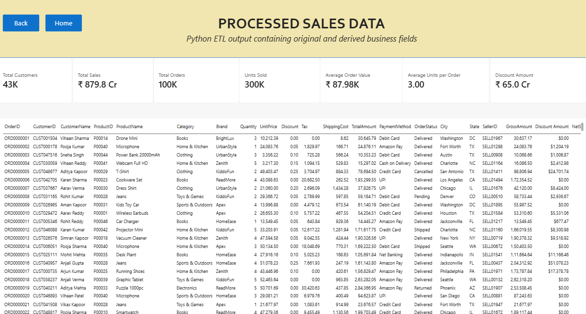
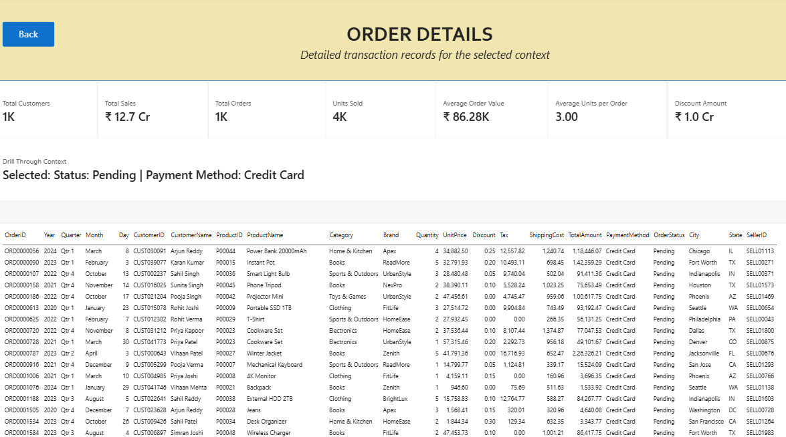

# Amazon Sales Analytics Dashboard

An interactive sales analytics dashboard built using Python and Microsoft Power BI to transform raw sales data into actionable business insights.



## Project Overview

This project demonstrates an end-to-end business intelligence workflow:

**Raw Sales Data → Python ETL → Processed Dataset → Power BI → DAX → Business Insights**

The project uses the Kaggle Amazon Sales Dataset and processes 100,000 sales records using Python before loading the transformed data into Power BI.

The dashboard focuses on sales performance, product and brand analysis, customer behaviour, order patterns and detailed transaction analysis.

## Key Features

- Python-based ETL pipeline using Pandas
- USD to INR currency conversion during ETL
- Data cleaning and transformation
- 30-field processed dataset
- DAX-based business metrics
- Interactive Power BI dashboards
- Indian currency and number formatting
- Drill-through order analysis
- Interactive slicers and filtering
- Row-Level Security (RLS)
- Customer, product and order analysis

## Dashboard Preview

### Sales Performance Overview



Provides high-level KPIs and monthly sales trends.

### Sales Analysis



Analyses category performance, brand distribution, order value and monthly sales versus discounts.

### Order & Customer Insights



Provides insights into customer activity, order behaviour, payment methods and shipping costs.

### Processed Sales Data



Displays the processed dataset generated by the Python ETL pipeline.

### Order Details



Provides detailed transaction-level analysis through Power BI drill-through functionality.

## ETL Pipeline

The Python ETL process performs the following steps:

1. Load the raw CSV dataset using Pandas
2. Convert order dates into datetime format
3. Clean text fields
4. Convert monetary values from USD to INR
5. Calculate gross sales amount
6. Calculate discount amount
7. Calculate net sales amount
8. Extract year, month, quarter and day information
9. Create order value bands
10. Export the processed dataset as a CSV file

## Derived Fields

The ETL pipeline creates additional business and time-based fields including:

- GrossAmount
- DiscountAmount
- NetSalesAmount
- OrderYear
- OrderMonth
- OrderMonthName
- OrderQuarter
- OrderDayOfWeek
- OrderDayNumber
- OrderValueBand

## Power BI Dashboard

The report contains six pages:

| Page | Purpose |
|---|---|
| Home | Dashboard navigation and project introduction |
| Sales Performance Overview | KPIs and overall sales trends |
| Sales Analysis | Category, brand and order-value analysis |
| Order & Customer Insights | Customer and order behaviour |
| Processed Sales Data | Python-generated processed dataset |
| Order Details | Drill-through transaction analysis |

## Power BI Features

The dashboard uses:

- DAX measures
- Interactive slicers
- Drill-through
- Page navigation
- Bookmarks
- Dynamic currency formatting
- Indian number formatting
- Row-Level Security
- Interactive filtering
- KPI cards
- Time-based analysis

## Row-Level Security

The project demonstrates Row-Level Security using user-based regional access.

An access-mapping table is used to associate users with permitted states. DAX using `USERPRINCIPALNAME()` is then used to determine the appropriate data access.

This demonstrates how Power BI can restrict data based on the authenticated user.

## Key Metrics

- **100,000** sales records
- **30** processed fields
- **300K** units sold
- **~₹879.8 Cr** total sales
- **~43K** customers

## Technologies

- Python
- Pandas
- Microsoft Power BI
- DAX
- Power Query
- CSV

## Project Structure

```text
Amazon-Sales-PowerBI/
│
├── data/
│   └── Amazon_ETL_Processed.csv
│
├── etl/
│   └── amazon_etl.py
│
├── powerBi/
│   └── Amazon_Sales_ETL_PowerBI.pbix
│
├── screenshots/
│   ├── Home.png
│   ├── Overview.png
│   ├── Sales-Analysis.png
│   ├── Order-Customer-Insights.png
│   ├── Processed-Sales-Data.png
│   └── Order-Details.png
│
├── .gitignore
└── README.md